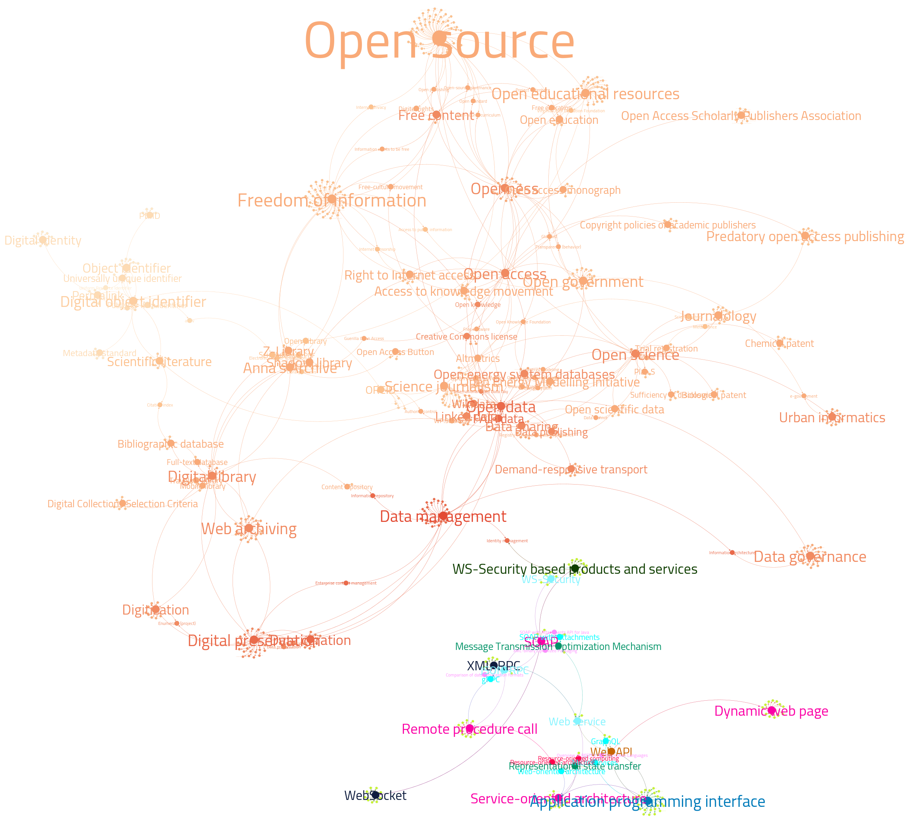

# literature-analysis-phd-june-23

Acest repo conține grafurile analizate în teza de doctorat (Universitatea Transilvania din Brașov). This repo hosts graph analysis of scientific literature used in the PhD thesis. This is needed for presentation and reporting.
